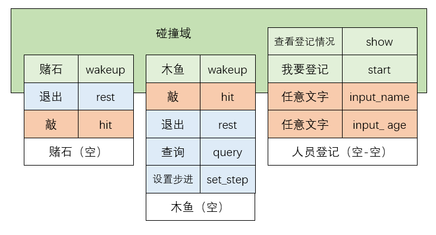
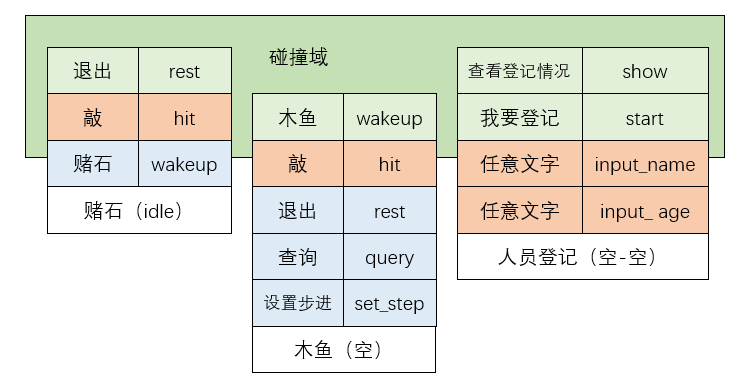
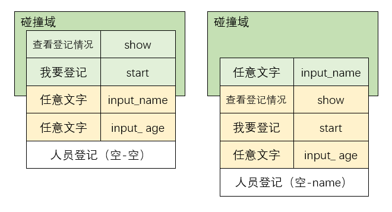

## 示例插件的命令表

### 赌石

| 命令       | 状态     | 方法   |
| ---------- | -------- | ------ |
| 赌石/stone | 空状态   | wakeup |
| 退出/exit  | 任意状态 | rest   |
| 敲/hit     | idle     | hit    |

### 木鱼

| 命令              | 状态     | 方法     |
| ----------------- | -------- | -------- |
| 木鱼/muyu         | 空状态   | wakeup   |
| 退出/exit         | 任意状态 | rest     |
| 敲/hit            | idle     | hit      |
| 查询功德/query    | idle     | query    |
| 调整步进/set step | idle     | set_step |

### 人员登记

| 命令         | 状态   | 子状态 | 方法       |
| ------------ | ------ | ------ | ---------- |
| 查看登记情况 | 空状态 | 空状态 | show       |
| 我要登记     | 空状态 | 空状态 | start      |
| *任意文字*   | 空状态 | name   | input_name |
| *任意文字*   | 空状态 | age    | input_age  |

## 避免命令碰撞

示例中的三个插件，通过ayaka可以一定程度上解决命令碰撞的问题

假设机器人收到了一条消息`敲`，但`赌石`、`木鱼`、`人员登记`都有相应的命令规则符合，显然你并不希望他们三个全都对该消息做出响应

| 猫猫     | 命令       | 状态   | 方法 |
| -------- | ---------- | ------ | ---- |
| 赌石     | 敲/hit     | idle   | hit  |
| 木鱼     | 敲/hit     | idle   | hit  |
| 人员登记 | *任意文字* | 空状态 | name | input_name |
| 人员登记 | *任意文字* | 空状态 | age  | input_age  |

借助ayaka，这种情况并不会发生

## 碰撞域

图1

当机器人收到`赌石`命令后，碰撞域发生变化，这是因为在`wakeup`函数中，赌石的状态从`空状态`变更为了`idle`

图2

碰撞域之外的回调不会参与竞争消息响应，因此只要红色的回调没有同时处于碰撞域之中，就不会出现命令碰撞

## 状态

所有的命令回调、文字回调都会要求注册在某个猫猫的某个状态下，之后，仅当该猫猫处于该状态时，这些回调才能进入碰撞域，从而有资格处理消息

## 通用状态

为方便起见，设计了`*`状态作为通用状态，它匹配一切**非空状态**

## 状态与群聊

各个群聊具有独立的碰撞域

例如，群聊1的碰撞域可如图1所示，同一时刻，群聊2的碰撞域可如图2所示，二者的碰撞域情况各不相同，互不干涉

这是由于不同群聊中，`赌石`猫猫的`状态`可以各不相同，互不干涉

## 子状态

为了进一步精细化状态控制，ayaka在0.0.2.0版本后，推出了子状态这一概念

不同群聊中，`赌石`猫猫的`状态`可以各不相同，互不干涉

而同一群聊、不同群成员中，`赌石`猫猫的`子状态`可以各不相同，互不干涉

同样的，子状态也有通用子状态，其与通用状态作用方式相同

## 下一步

    在这里~ ↘

